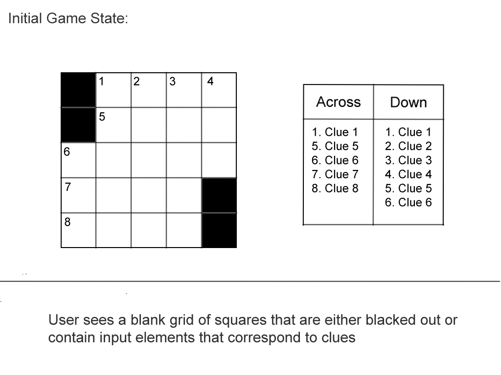
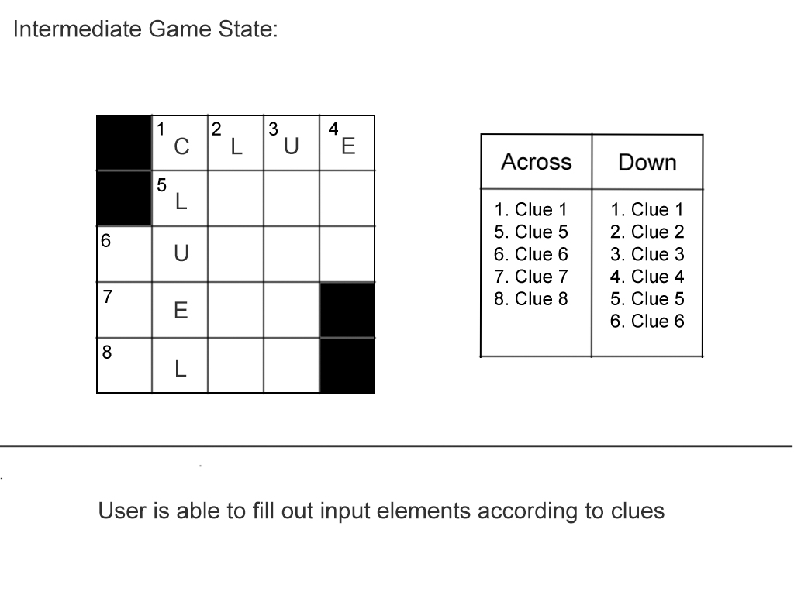
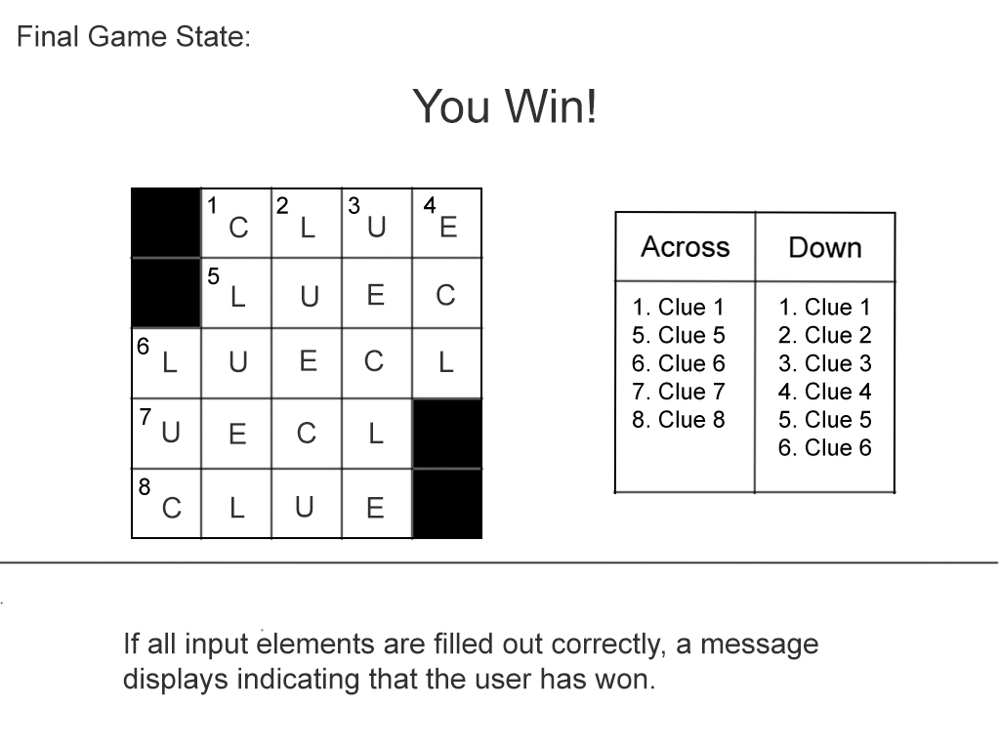

# Crossword Puzzle

## Overview
A crossword is a puzzle consisting of a grid of squares and blanks into which words crossing vertically and horizontally are written according to clues. I chose to build this game because I enjoy the intersection of logic and wordplay, and because I've spent a great deal of time completing crossword puzzles and it would be exciting to break the puzzle down into its smallest parts in order to rebuild it.

## Game Rules
The user completes the puzzle by first reading the provided clues and trying to guess the correct words according to a) the amount of letters in the word and b) intersecting letters that have already been filled out. The user wins by correctly guessing all the vertical and horizontal words.

## Wireframes

## User stories
1) The game starts with a blank 5x5 grid of 25 squares that are either blacked out or able to accept a single letter input. Next to the grid is a list of clues corresponding to the vertical and horizontol words, which are split into seperate lists. The clues are numbered and correspond to numbers on the grid itself to indicate which clue will solve which word.
2) If the user correctly fills out the entire grid, a message will display indicating that the've won. There is not necessarily a way to actively lose the game, but it is certainly possible to not win. 

## MVP checklist
* User input is checked against correct letters.
* If all input matches the pretdetermined correct letters, a message displays indicating that the user has won.
* User is able to alter previous inputs without reloading the game.

## Stretch goals
### Game flow:
* After input is entered, flow from one box within a word to the next without clicking into it.
* Words are intitally filled out in across/row format but can be toggled to down/column by either clicking a toggle button or double clicking on any box in the word.
* Game will remember orientation from one word to the next.

### Buttons/Display Elements:
* Automatically store inputs without hitting "enter"
* Show time elapsed
* Option to clear board of user input
* Option to check guesses 
* Option to reveal puzzle

## Code Snippets
To show time elapsed:

    var totalSeconds = 0;
    const updateTimer = () => {
    ++totalSeconds;
    seconds.innerText = formatTimer(totalSeconds % 60);
    minutes.innerText = formatTimer(parseInt(totalSeconds / 60));
    };

    function formatTimer(val) {
    var valString = val + "";
    if (valString.length < 2) {
        return "0" + valString;
    } else {
        return valString;
    }
    }

    countUp = setInterval(updateTimer, 1000);

    document.addEventListener("DOMContentLoaded", updateTimer);

To check answers: 

    const letterKey = {
    one: "C",
    two: "H",
    three: "E",
    four: "R",
    five: "L",
    six: "O",
    seven: "W",
    eight: "E",
    nine: "B",
    ten: "A",
    eleven: "T",
    twelve: "E",
    thirteen: "D",
    fourteen: "E",
    fifteen: "V",
    sixteen: "E",
    seventeen: "R",
    eighteen: "E",
    nineteen: "E",
    twenty: "L",
    twentyone: "S",
    };

    const inputs = document.querySelectorAll(".box > input");
    const checkButton = document.querySelector("#check-puzzle");

    const checkPuzzle = () => {
    for (i = 0; i < inputs.length; i++) {
        let inputUpper = inputs[i].value.toUpperCase();
        if (inputs[i].value !== "" && inputUpper !== letterKey[inputs[i].id]) {
        inputs[i].classList.add("incorrect");
        grid.addEventListener("input", removeIncorrect);
        }
    }
    };

    const removeIncorrect = (e) => {
    let targetInput = e.target;
    targetInput.classList.remove("incorrect");
    };

    checkButton.addEventListener("click", checkPuzzle);

## Technologies Used
JavaScript, CSS3 and HTML5